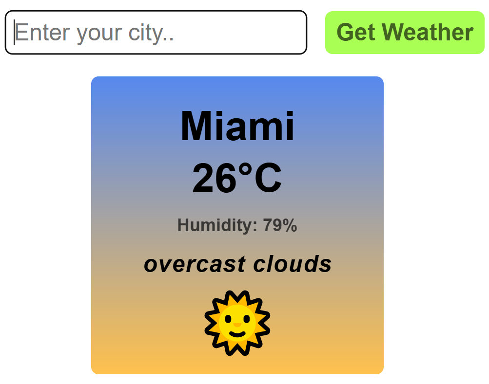

# 🌟 Weather App
  
Welcome to **Weather App**, This is a simple **personal project** that allows users to know the weather of the city they live in by entering the name of their city.
This is an application that shows my JavaScript skills, and also allows me to get familiar with API 🚀
## 🛠 Technology
- **HTML**, **CSS**, **JavaScript**,**API**
## ✨Key Features:
- 🔍 Search for the weather of the city you need
- 🔔 Notify users when typing errors
- 💻 Show weather information
